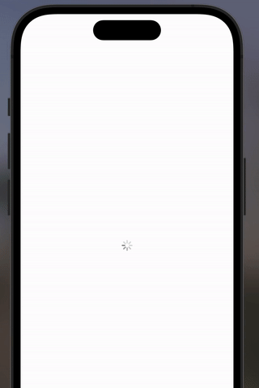
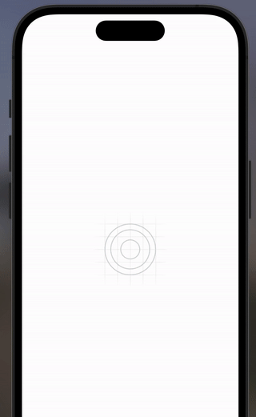

# React Native Loading Image

Simple an ready to use Image Component with loading indicator, fade in animation, an no-image placeholder for error handling.

Build on top of React Native's Image component, with the same API and props.

Highly customizable.

The component is intended to be easy to use. Provide good user experience while displaying network images by taking care of all possible states: loading, error, and success.

## Installation

```sh
npm install rn-loading-image
```

or

```sh
yarn add rn-loading-image
```

## Usage



Import the LoadingImage component, which supports all the props of the Image component from react-native.

```js
import React from 'react';
import { StyleSheet, View } from 'react-native';
// Import the component
import { LoadingImage } from 'rn-loading-image';

export default function App() {
  return (
    <View style={styles.container}>
      <LoadingImage
        source={{
          uri: 'https://upload.wikimedia.org/wikipedia/commons/9/9d/Golden_Gate_Bridge_.JPG',
        }}
      />
    </View>
  );
}

const styles = StyleSheet.create({
  container: {
    flex: 1,
    alignItems: 'center',
    justifyContent: 'space-evenly',
  },
});
```

## Customization

Change the duration of the fade in animation, the size or color of the loading indicator, no-image place holder, or provide your custom components.

```js
import React from 'react';
import { StyleSheet, View, Text } from 'react-native';
// Import the component
import { LoadingImage } from 'rn-loading-image';

export default function App() {
  return (
    <View style={styles.container}>
      {/* Test No Image placeholder */}
      <LoadingImage
        source={{
          uri: 'https://wrong-url.com',
        }}
      />

      <LoadingImage
        source={{
          uri: 'https://p1.pxfuel.com/preview/324/157/238/scotland-united-kingdom-england-isle-of-skye.jpg',
        }}
      />

      <LoadingImage
        // Change fade in animation duration
        fadeInDuration={100}
        source={{
          uri: 'https://c0.wallpaperflare.com/preview/991/190/484/lighthouse-ushuaia-beagle-channel-argentina.jpg',
        }}
        // Change loading indicator color and size
        activityIndicatorProps={{
          color: 'red',
          size: 'large',
        }}
      />

      <LoadingImage
        fadeInDuration={2000}
        source={{
          uri: 'https://cdn.pixabay.com/photo/2020/04/12/01/58/iguazu-falls-5032457_1280.jpg',
        }}
        // Provide you custom loading indicator component
        customLoadingComponent={<Text>Loading...</Text>}
      />
    </View>
  );
}

const styles = StyleSheet.create({
  container: {
    flex: 1,
    alignItems: 'center',
    justifyContent: 'space-evenly',
    marginTop: 50,
    marginBottom: 100,
  },
});
```



**Using the imageStyle attribute and all the normal props of a stand Image component you can customize as much as you want**

## API

The component inherits all the props of the Image component from react-native.

The only difference is that the "style" props was removed, and replaced by "imageStyle" and "containerStyle" props.

Some props where added to customize the loading indicator, the no-image placeholder, and the fade in animation.

```js
interface LoadingImageProps extends Omit<ImageProps, 'style'> {
  fadeInDuration?: number; // default value is 300 ms

  imageStyle?: StyleProp<ImageStyle>; // default height and size is 100

  containerStyle?: StyleProp<ViewStyle>; // customize the container style

  activityIndicatorProps?: React.ComponentProps<typeof ActivityIndicator>; // default color is grey and size is small

  customLoadingComponent?: React.ReactNode; // provide your custom loading component

  missingImageStyle?: StyleProp<ImageStyle>; // default height and size is  50

  customMissingImageComponent?: React.ReactNode; // provide your custom no-image placeholder component
}
```

## Contributing

See the [contributing guide](CONTRIBUTING.md) to learn how to contribute to the repository and the development workflow.

## License

MIT

---

Made with [create-react-native-library](https://github.com/callstack/react-native-builder-bob)
